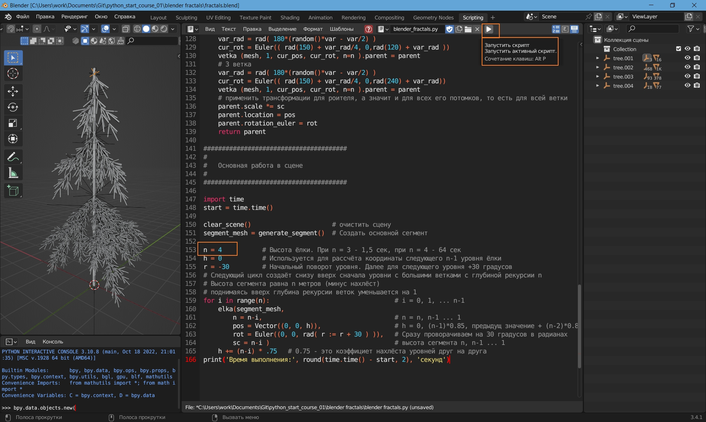
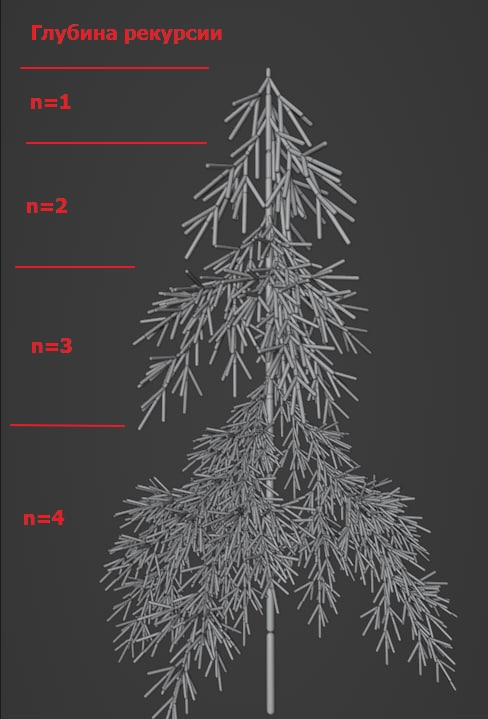

# Фракталы в Blender

## Для запуска

1. Скачать и установить [Blender](https://www.blender.org/download/). Он бесплатный.
2. Открыть файл *.blend

3. Можно изменять параметры. И запускать скрипт (выделено оранжевой рамкой на картинке)

## Что сделать

* Добавить параметров (например, количество веток)
* Добавить вариативность на количествов веток
* сейчас скрипт после нескольких запусков оставляет мусор,
  который не сохраняется в файле, но хранится в памяти.
  Улучшить функцию очистки сцены.
* может как-то оптимизировать для более быстрой работы.
  при 
  n=3 скрипт работает 1.5 секунды
  n=4 минуту
  n=5 вероятно будет по геометричесой прогрессии (до часа ?)
  При этом интерфейс подвисает. 
  * добавить предупреждение
  * добавить визуализацию прогресса 

## Результат работы скрипта при n=4

